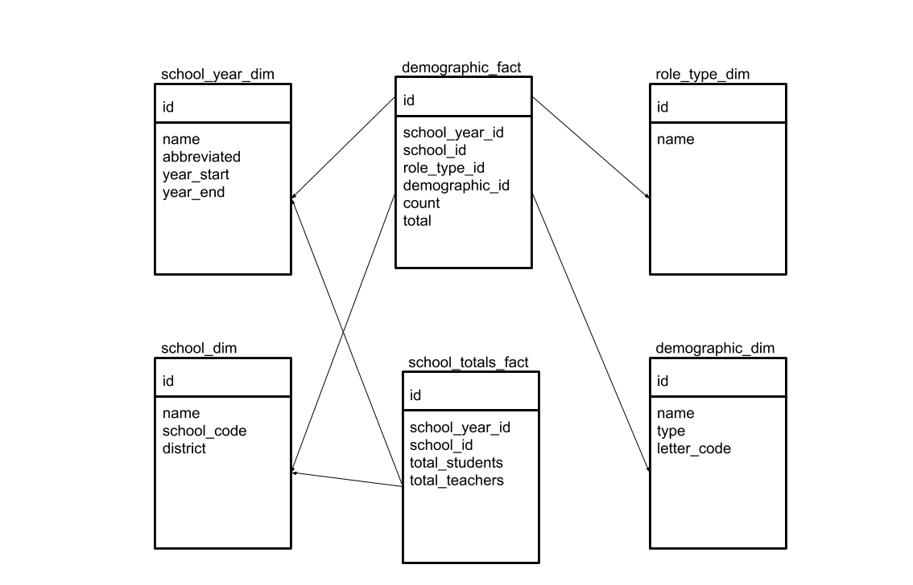

# Demographics

What are the student and teacher demographics among schools within the
Kent, Auburn, and Renton School Districts?

## Data Sources

"2016-2017 Final S-275 Personnel Database (Access database)" 

- http://www.k12.wa.us/safs/db.asp
- `data_sources/2016-2017_Final_S-275_Personnel_Database.accdb`
- Wrote a simple program to convert the table in the Access db to a
  `personnel.csv` file (used Java b/c of availability of a pure JDBC
  driver for Linux)
- Used MySQL Workbench to auto-import csv into `personnel` table

"Demographic Information by School (Excel or Text file)"

- http://reportcard.ospi.k12.wa.us/DataDownload.aspx
- `data_sources/2017_School_Demographics.txt`
- Used MySQL Workbench to auto-import csv into `students` table

School directory

- export of schools from https://eds.ospi.k12.wa.us/DirectoryEDS.aspx
- `data_sources/Washington_School_Directory_20180617.csv`
- Created `Washington_School_Directory_20180617-processed.csv` by
  loading original into LibreOffice Calc and exporting as CSV, to get
  rid of Excel-specific '=' prefix used to coerce numeric to text values
- Used MySQL Workbench to auto-import csv into `school_directory` table

## Tools

Linux, Java, MySQL, MySQL Workbench, LibreOffice

## Understanding the Data

personnel table: 564281 records - each row represents an assignment at a school

- examined original form and handbook for S-275 form to understand fields and codes

 - `droot` column - duty code; filter on this to get only teachers (not all personnel are teachers)
 - `race` column - multivalued
 - `sex` column
 - `hispanic` column
 - `bldgn` column - school code

students table: 2445 records - each row represents a school

- counts are stored column-per-demographic: `NumberAsian`, `NumberBlack`, etc.
- `BuildingNumber` column - school code

General notes:

- different levels of granularity: student table is aggregated; personnel is not
- multi-valued race field and abstaining from racial identification means totals can't be derived (non-additive)
- need a separate fact table for per-school totals

## Model



## ETL

To load the raw data and run the ETL:

```
echo "CREATE DATABASE demographics;" | mysql
# load 'raw' data from sources
cat personnel.sql.gz | gunzip | mysql demographics
cat students.sql.gz | gunzip | mysql demographics
cat school_directory.sql.gz | gunzip | mysql demographics
# etl.sql can be re-run to re-create and re-populate fact + dimensional tables
cat etl.sql | mysql demographics
```

## Reports

Several views facilitate reporting. See the `etl.sql` file for their definitions.

- demographics_by_school
- demographics_by_district
- school_counts
- district_counts
- summary_demographics_by_school - joins demographics_by_school w/ school_counts
- summary_demographics_by_district - joins demographics_by_district w/ district_counts

Demographics report by school (by_school.csv):

```
SELECT * FROM summary_demographics_by_school
WHERE school_year = '2016-2017'
AND district IN ('Kent School District', 'Auburn School District', 'Renton School District')
ORDER BY district, school, role, type, demographic;
```

Demographics report by district (by_district.csv):

```
SELECT * FROM summary_demographics_by_district
WHERE school_year = '2016-2017'
AND district IN ('Kent School District', 'Auburn School District', 'Renton School District')
ORDER BY district, role, type, demographic;
```

## Future Updates / Other Considerations

The dimensional schema can accommodate data for additional school years:

- add a new school year dimension row
- add rows to the demographic_fact and school_totals_fact tables

Handling updates: 

- the main challenge re: teachers is the lack of a stable identifier:
  can the 'cert' field be used for this purpose? need more info
- updates for the students file would be easier to handle since it is
  already aggregated
- when possible, re-creating the whole data set is preferable to
  selective updates, which have to account not only for simple case of
  attribute changes, but identifier changes and deletions.

SQL Server

- generally better suited for reporting functionality than MySQL
- probably more optimal ways to write some of this using T-SQL (pivot,
  handling multivalued fields, etc.)

Validation:

- none!
- assumed that the data from OSPI is high quality
- more robust ETL for dirty data sets would check for absence of
  schools, sanity-check counts, invalid codes or values
- should probably use Python instead of pure SQL

## Further Uses

Plotting schools on a map:

- the school directory file contains street addresses that could be
  geolocated via Google's Geolocation API. This data would be stored
  on the school_dim table.

Understanding the demographics of the school catchment area:

- the challenge is that catchment areas often don't align neatly with
  regions like census tracts, for which there exists readily available
  demographic data.
- first step would be to find or create shapefiles for school
  catchment areas, then look for granular sets of demographic data
  that fall within those areas
- third party? proximityone.com?
